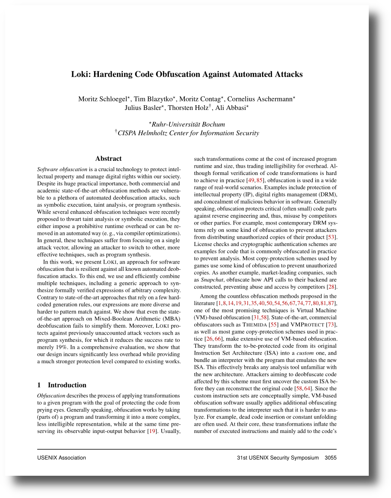

# Loki: Hardening Code Obfuscation Against Automated Attacks
<a href="https://www.usenix.org/conference/usenixsecurity22/presentation/schloegel">  </a>


Loki is an academic obfuscator prototype developed to showcase novel VM handler hardening techniques.

It is based on our [paper published at Usenix Security '22 (link)](https://www.usenix.org/conference/usenixsecurity22/presentation/schloegel):

```
@inproceedings{schloegel2022loki,
    author = {Moritz Schloegel and Tim Blazytko and Moritz Contag and Cornelius Aschermann and Julius Basler and Thorsten Holz and Ali Abbasi},
    title =  {{Loki}: Hardening Code Obfuscation Against Automated Attacks},
    year = {2022},
    booktitle = {USENIX Security Symposium} 
}
```

In this repository, we open-source our implementation and evaluation tooling. Please note that this is _research code_: Our academic prototype is not intended for use in production but provided as-is. Unless otherwise specified, all our code and data are licensed under AGPL3. Loki has been awarded the *Artifact Available*, *Artifact Functional*, and *Artifact Reproduced* badges by the Usenix Artifact Evaluation Committee.

### Further Resources

We released an additional [artifact on Zenodo](https://zenodo.org/record/6686932) which contains binaries and data produced during our evaluation.

Beyond our paper, a [technical report](https://arxiv.org/abs/2106.08913) with more details is available on arxiv.


# Structure
This repository is structured as follows:

1) [loki](./loki): contains our prototype of an obfuscator, testcases, and a script to generate obfuscated targets
2) [lokiattack](./lokiattack): contains our evaluation tooling to attack binaries obfuscated by Loki
3) [experiments](./experiments): all experiments of our evaluation, documented and with scripts to reproduce them


# Installation

The easiest way to use Loki is Docker.
## Docker
We provide a Dockerfile and a few convenience/helper scripts.

### Build docker image
Run `./docker_build.sh` -- the image name is set in [docker_data/docker_config.sh](docker_data/docker_config.sh). By default, this will use all available CPU cores (as determined by `nproc`). If this is not desired, set `PARALLEL_JOBS` in [docker_build.sh](docker_build.sh) to the number of cores you want to use.

In general, we recommend building and running this on a server with at least 64GB of RAM. Both for building the image and running the experiments, more CPU cores and higher amounts of RAM are beneficial. If running out of RAM, set `PARALLEL_JOBS` to a lower value.

### Run docker container
Run `./docker_run.sh` twice: First time, the docker container is started. If running `./docker_run.sh` while the container is running, you are connected (`/bin/zsh`). The bash and zsh history are saved (as is zshrc) in [docker_data](./docker_data). This directory is available as volume within the container as `/home/user/loki`, which allows to copy files to/from the container.

### Stop docker container
To stop (and delete) the container, run `./docker_stop.sh`.

## Steps within Docker & Dependencies
Once within the Docker container, install all tools and dependencies by running:
```
./setup.sh
```
This script will use all available cores (as determined by `nproc`). If this is not desired, set `PARALLEL_JOBS` in [docker_data/zshrc](docker_data/zshrc) to the number of cores you want to use. This environment variable is used by all build scripts, however, has no effect on experiment scripts.

### Manual installation of dependencies

_Alternatively_, install the dependencies manually.

1. Install Loki (and z3)
```
cd loki
./build.sh
```
2. For [LokiAttack](./lokiattack/), run:
```
cd lokiattack
python3 -m pip install --user -r requirements.txt
./install_triton.sh
```
3. Finally, install Intel Pin for tracing needed by Experiment 2:
```
cd experiments/experiment_02_coverage/tracer
./install_pin.sh
```


# Getting started

Once you built our docker container and installed the dependencies, you can either look at our experiments in [experiments](./experiments/); their documentation and code are a good starting point to get familiar with the full functionality provided by Loki and LokiAttack.

If you are interested in obfuscation, head to [loki](./loki), which is our prototype implementation capable of obfuscating code (with limitations). For practical uses, the high-level wrapper script [obfuscate.py](./loki/obfuscate.py) should be sufficient to generate obfuscated binaries. If you are interested in the deeper architecture, make sure to checkout Loki's two components:
* [translator](./loki/translator/): This C++ component is responsible for parsing the input program and lifting the to-be-obfuscated function. Once the second component has processed the input, the translator will compile the final binary.
* [obfuscator](./loki/obfuscator/): This Rust component works on the lifted representation of the function and applies the actual obfuscation transformations.

If you are more interested in deobfuscation, look at [lokiattack](./lokiattack/), which provides an attack framework that extracts all of Loki's handler, such that different attacks can be tested (e.g., taint analysis, symbolic execution, or program synthesis). We provide plugins for these techniques; if you come up with an own, write your own plugin! For most uses, our wrapper script [run.py](./lokiattack/run.py) should provide a sufficient interface to unlock LokiAttack's capabilities.

# Contact

For more information, contact [m_u00d8](https://github.com/mu00d8) ([@m_u00d8](https://twitter.com/m_u00d8)) or [mrphrazer](https://github.com/mrphrazer) ([@mr_phrazer](https://twitter.com/mr_phrazer)).

